---

## Abstract

Accurate prediction of daily heat pump (HP) electricity consumption at the household level is essential for smart grid management, energy auditing, and HP fleet optimisation. This study presents a comprehensive machine learning (ML) benchmark using the HEAPO dataset (Brudermueller et al., 2025) — a longitudinal open dataset of 1,298 Swiss households spanning five years of daily smart meter data (2019–2024), matched to eight MeteoSwiss weather stations, 13-variable household survey metadata, and 410 on-site HP inspection protocols.

A two-track analysis framework is adopted. **Track A** evaluates six models — ElasticNet, Decision Tree (DT), Random Forest (RF), XGBoost, LightGBM, and an Artificial Neural Network (ANN) — on all 826 test-set households using 45 engineered features. **Track B** evaluates three protocol-enriched models (XGBoost B, DT B, RF B) on 109 treatment households with full on-site inspection data (75 features). All models are evaluated on a held-out heating-season test set (December 2023 – March 2024) using Root Mean Squared Error (RMSE) as the primary metric.

**RQ1 (Model accuracy):** RF achieves the best Track A performance (RMSE = 11.54 kWh, R² = 0.728, MAE = 7.47 kWh). XGBoost and LightGBM are statistically tied with RF (p < 10⁻¹⁸³ but Δ = 0.11 kWh). Tree ensemble models substantially outperform ElasticNet (RMSE = 20.40 kWh, R² = 0.151) and ANN (RMSE = 15.56 kWh). Among three protocol-enriched Track B models, XGBoost B achieves RMSE = 26.06 kWh (R² = -0.464), a 27% improvement over Track A RF on the same households.

**RQ2 (Interpretability):** Reactive energy (inductive kVArh component) is the dominant predictor across all tree-based models — removing it increases RF RMSE by 9.9 kWh — followed by building living area and number of residents. Feature rankings are highly consistent across tree models (Spearman ρ = 0.88–0.96). RF augmented with SHAP post-hoc explanations provides the best accuracy–interpretability trade-off.

**RQ3 (Subgroup bias):** Heat distribution system (floor heating vs. radiators) is the most significant bias dimension (Bonferroni-corrected p < 10⁻⁷²), with a median residual difference of 1.07–1.34 kWh across the top three models. EV households are systematically over-predicted; PV households are marginally under-predicted due to a self-consumption measurement gap inherent to the dataset.

---

## 1. Introduction

### 1.1 Motivation and Problem Context

Heat pumps are the primary electrification technology for space heating and domestic hot water in Switzerland and across Europe. As of 2023, Switzerland operates over one million HP installations, with annual growth rates exceeding 15%. For distribution grid operators, accurate daily-resolution HP electricity forecasts are essential for demand response scheduling, grid stability, and tariff design. For energy service companies and HP fleet managers, consumption prediction enables anomaly detection, benchmarking, and proactive optimisation of HP settings.

Predicting HP electricity consumption is physically tractable: heat demand is dominated by outdoor temperature through the building envelope's heat loss coefficient, modulated by building area, insulation quality, and occupant behaviour. Yet in practice, the prediction problem is complicated by: (i) unobservable self-consumed photovoltaic energy in the target variable for PV households; (ii) heterogeneity in HP system types, configurations, and settings; (iii) secondary loads (electric vehicles, dryers) that share the smart meter with the HP; and (iv) the limited availability of detailed installation metadata for most households. Daily resolution avoids intra-day noise while retaining seasonal and weather-driven variation — the primary drivers of HP load.

### 1.2 The HEAPO Dataset

The HEAPO dataset (Brudermueller et al., 2025; arXiv:2503.16993v1; Zenodo record 15056919) is an open longitudinal dataset of 1,298 Swiss households in Canton Zurich, collected between January 2019 and March 2024. It combines four data sources:

- **Smart meter data (SMD):** daily active and reactive energy readings at 15-minute and daily resolution, for all 1,298 households. 214 households belong to a treatment group that received an energy consultant visit; the remaining 1,084 are a control group.
- **Weather data:** daily observations from 8 MeteoSwiss stations, including mean/min/max temperature, humidity, precipitation, sunshine duration, and Swiss standard heating degree days (HDD\_SIA).
- **Household survey metadata:** 13 self-reported variables per household (building type, living area, number of residents, HP type, heat distribution system, domestic hot water source, and appliance ownership).
- **On-site inspection protocols:** 410 structured reports from energy consultants, covering HP installation year, rated capacity, heating curve settings, identified issues (heating curve too high, night setback active, heating limit too high), and post-visit recommendations. Of these, 196 protocols correspond to households without SMD (orphan reports); the remaining 214 link to treatment-group households.

A critical measurement limitation must be stated upfront: the target variable (`kWh_received_Total`) represents **net grid consumption** — the energy drawn from the grid. For the 44.8% of test-set households with photovoltaic (PV) systems, solar energy that is self-consumed without reaching the grid is invisible in the dataset. This is acknowledged explicitly in the HEAPO paper (Section 2.1.2) and constitutes a fundamental constraint on all model performance for PV households.

### 1.3 Research Questions

This study addresses three research questions:

**Main RQ:** Which machine learning models provide the most accurate and robust predictions of household energy use under real-world household, installation, technical and weather conditions?

**RQ1:** How do tree-based models (DT, RF, GBT) compare to Linear Regression (LR) and ANN in terms of predictive accuracy when applied to household, installation, technical, and weather data?

**RQ2:** How can interpretability methods (e.g. SHAP values and permutation importance) inform our understanding of energy use predictions, and what trade-offs exist between predictive accuracy and interpretability across models? This analysis will identify which household features (e.g. building type, building age and occupancy), installation characteristics (e.g. heat pump type and installation year), and weather variables (e.g. average outdoor temperature and heating degree days) most strongly influence model outputs.

**RQ3:** What systematic error patterns or biases emerge across different household and installation subgroups? Residual analysis and subgroup comparisons will be used to detect whether models consistently under- or over-predict household energy use in specific contexts, such as older versus newer buildings and detached houses versus apartments. This ensures fairness and generalizability of the results.

RQ1 is answered in Section 3 via test-set model comparison, hyperparameter tuning analysis, seasonal breakdown, and feature-set ablation. RQ2 is addressed in Section 4 via SHAP analysis and permutation importance. RQ3 is addressed in Section 5 via subgroup residual analysis and Bonferroni-corrected Mann-Whitney U tests.

### 1.4 Contributions

This study makes four primary contributions:

1. **First comprehensive ML benchmark on HEAPO** for daily HP electricity consumption prediction, covering six model families with rigorous hyperparameter tuning (Bayesian optimisation, 390 total Optuna trials).
2. **Two-track evaluation framework** separating household-metadata-only features (Track A, 826 households) from protocol-enriched features (Track B, 109 households; three models: XGBoost B, DT B, RF B), with ablation quantifying each data source's marginal contribution.
3. **Systematic fairness analysis** across 13 subgroup dimensions (HP type, heat distribution, PV presence, EV ownership, living area, group membership, and protocol-specific variables) with formal Bonferroni-corrected statistical testing.
4. **Novel finding:** reactive energy metering (kVArh inductive component) is the dominant predictor across all tree-based models — a result not previously reported for daily HP consumption prediction. This has practical implications for smart meter specification in HP monitoring programmes.

### 1.5 Paper Structure

Section 2 describes the data, preprocessing decisions, and methodology. Section 3 presents model comparison results (RQ1). Section 4 presents interpretability analysis (RQ2). Section 5 presents subgroup bias analysis (RQ3). Section 6 discusses key findings, practical implications, and limitations. Section 7 concludes.

---

## 2. Data and Methodology

### 2.1 Dataset Description

**Table 2.1 — HEAPO Dataset Overview**

| Attribute | Value |
| :--- | :--- |
| Households with daily SMD | 1,298 |
| Date range | 2019-01-01 – 2024-03-21 |
| Total daily records (raw) | ~900,000 |
| Weather stations | 8 (MeteoSwiss, Canton Zurich) |
| Household survey variables | 13 |
| On-site inspection protocols | 410 (214 treatment-linked, 196 orphans) |
| Treatment HH with pre+post SMD | 151 |
| Households after ≥180-day filter | 1,272 |
| **Track A training set** | **646,258 rows, 1119 HH** |
| **Track A validation set** | **153,594 rows, 856 HH** |
| **Track A test set** | **74,368 rows, 826 HH** |
| **Track B test set** | **5,475 rows, 109 HH** |

The temporal split follows a strictly chronological design to prevent data leakage: training data precedes June 2023, validation covers the non-heating season (June–November 2023), and the test set covers the peak heating season (December 2023 – March 2024). Mean daily HP consumption differs substantially across splits: 28.4 kWh/day (train), 17.5 kWh/day (validation), and 39.1 kWh/day (test) — reflecting seasonal consumption patterns. The test set is therefore the most challenging split (highest mean and variance), making the reported RMSE a conservative estimate of year-round model performance.

### 2.2 Data Preprocessing

**Target variable:** `kWh_received_Total` — net daily active energy drawn from the grid. For households with dual meters (separate HP and other-appliance meters), consistency was verified per day (|HP + Other − Total| < 0.01 kWh for all records).

**Missing data:** Numeric household features (living area, number of residents) were imputed with training-set medians; imputation flag columns were added. Categorical features with missing values (HP type, building type) were assigned an "Unknown" category rather than the mode — preserving uncertainty information. Protocol features are available only for Track B and were not imputed for Track A.

**Outlier handling:** days with `kWh_received_Total` ≤ 0 were removed. Per-household IQR outlier flagging was applied (3× IQR from Q1/Q3); extreme values were reviewed but not automatically removed (some extreme cold-day consumption is legitimate).

**Treatment group:** rows labelled `AffectsTimePoint = "during"` (the visit day itself) were excluded. A binary `post_intervention` flag (1 = after consultant visit) was added to all treatment-household rows; this column was deliberately excluded from the feature set to avoid directly signalling treatment status to the model.

**PV households:** 44.8% of test-set households return energy to the grid (`kWh_returned_Total > 0`). The `has_pv` binary flag and `kWh_returned_Total` rolling statistics are included as features to partially capture PV generation behaviour, but self-consumed PV energy remains unobservable in the target.

**Minimum data threshold:** households with fewer than 180 days of valid data, or without coverage in both heating and non-heating seasons, were excluded (reducing from 1,298 to 1,272 households).

### 2.3 Feature Engineering

**Table 2.2 — Feature Set Summary**

| Category | Track A | Track B only | Examples |
| :--- | ---: | ---: | :--- |
| Temporal | 6 | 0 | `day_of_week`, `month`, `is_heating_season`, `season` |
| Weather (direct) | 8 | 0 | `Temperature_avg_daily`, `HDD_SIA_daily`, `Humidity_avg_daily` |
| Weather (rolling/lag) | 3 | 0 | `temp_avg_rolling_7d`, `temp_avg_lag_1d`, `HDD_SIA_rolling_7d` |
| Household static | 17 | 0 | Living area, HP type (one-hot), heat distribution, DHW source, appliances |
| Reactive energy | 2 | 0 | `kvarh_received_inductive_Total`, `kvarh_received_capacitive_Total` |
| Protocol / installation | 0 | 28 | Building age, HP capacity/area, heating curve gradients, issue flags |
| **Total (tree models)** | **45** | **75** |  |
| **Total (linear / ANN)** | **30** | **46** | *(scaled continuous features)* |

All rolling and lag features were computed within each household using `groupby('Household_ID')` operations to prevent cross-household data leakage. The heating curve gradient was derived from the protocol's three operating-point supply temperatures (at outdoor temperatures of +20°C, 0°C, and −8°C), yielding two segment gradients and a non-linearity indicator. The variable `HeatPump_ElectricityConsumption_YearlyEstimated` (the consultant's annual consumption estimate) was excluded from all feature sets as a target proxy that would constitute data leakage.

**Feature scaling:** StandardScaler (zero mean, unit variance, fit on training set only) was applied to ElasticNet and ANN inputs. Tree-based models received raw feature values. Log₁₊ₓ transformation was applied to the target variable for ElasticNet and ANN training; all reported predictions were back-transformed to kWh space via the inverse `expm1()` before metric computation.

### 2.4 Models and Hyperparameter Tuning

**Table 2.3 — Model Overview and Tuned Hyperparameters**

| Model | Type | Track | Key Tuned Hyperparameters (selection) |
| :--- | :--- | :---: | :--- |
| ElasticNet | Linear | A | alpha=0.0025; l1_ratio=0.6196 |
| Decision Tree (DT) | Tree | A | max_depth=19; min_samples_split=92; min_samples_leaf=5; max_features=None |
| Random Forest (RF) | Ensemble Tree | A | max_depth=30; min_samples_split=13; min_samples_leaf=5; max_features=0.5000 |
| XGBoost | Gradient Boosted Trees | A | max_depth=10; learning_rate=0.0381; subsample=0.9969; colsample_bytree=0.6213 |
| LightGBM | Gradient Boosted Trees | A | num_leaves=224; max_depth=14; learning_rate=0.0182; min_child_samples=16 |
| ANN (MLP) | Neural Network | A | n_layers=3; n_units_l0=128; n_units_l1=32; n_units_l2=128 |
| XGBoost B | Gradient Boosted Trees | B | max_depth=6; learning_rate=0.0225; subsample=0.8068; colsample_bytree=0.6299 |
| DT B | Tree | B | max_depth=15; min_samples_split=37; min_samples_leaf=5; max_features=None |
| RF B | Ensemble Tree | B | max_depth=None; min_samples_split=16; min_samples_leaf=1; max_features=0.5000 |

Hyperparameter optimisation used Bayesian search (Optuna framework, Akiba et al., 2019) with 30–80 trials per model and 5-fold GroupKFold cross-validation on the training set (grouped by `Household_ID`). The test set was held out entirely during tuning; model selection used mean validation RMSE across folds as the objective. Total Optuna trials: 390 (Track A) + 40 (XGBoost B) + 30 (DT B) + 40 (RF B) = 500 trials.

The ANN architecture uses three hidden layers (128–32–128 units with ReLU activations, Batch Normalisation, and Dropout) with the Adam optimiser, ReduceLROnPlateau scheduling, and early stopping (patience = 15 epochs on validation loss).

### 2.5 Evaluation Framework

The primary metric is **RMSE** (penalises large errors — relevant for grid planning where extreme-consumption days matter most). Secondary metrics:

- **MAE** (mean absolute error) — average error in kWh; interpretable in absolute terms
- **R²** — proportion of variance explained
- **sMAPE** (symmetric Mean Absolute Percentage Error) — percentage error, excluding days with consumption < 0.5 kWh to avoid division-by-zero artefacts (consistent with HEAPO paper Section 2.4)
- **MedAE** (median absolute error) — robust to extreme prediction errors

**Statistical significance:** pairwise Wilcoxon signed-rank tests on per-sample residuals (paired by Household\_ID + Date). Subgroup comparison tests use Bonferroni correction: adjusted significance threshold α = 0.05 / 24 = 0.0021.

**Robustness checks:** 5-fold GroupKFold cross-validation on the training set (same grouping as tuning); seasonal breakdown (validation: non-heating May–September vs. transition October–November); feature-set ablation quantifying the marginal contribution of each data source layer.

---

## 3. Results — RQ1: Model Comparison

### 3.1 Primary Test-Set Performance

**Table 3.1 — Test Set Performance (December 2023 – March 2024, N = 74,368 rows, 826 households)**

| Model | RMSE (kWh) | MAE (kWh) | R² | sMAPE (%) | MedAE (kWh) |
| :--- | ---: | ---: | ---: | ---: | ---: |
| **RF** | **11.54** | **7.47** | **0.728** | **21.3** | **4.79** |
| XGBoost | 11.59 | 7.82 | 0.726 | 22.4 | 5.32 |
| LightGBM | 11.65 | 7.81 | 0.723 | 22.3 | 5.28 |
| DT | 14.44 | 9.49 | 0.575 | 26.4 | 6.21 |
| ANN | 15.56 | 10.82 | 0.506 | 30.5 | 7.50 |
| ElasticNet | 20.40 | 14.22 | 0.151 | 38.5 | 10.04 |
| — | — | — | — | — | — |
| *Baseline: Per-HH Mean* | 20.32 | 14.44 | 0.158 | 41.9 | 10.23 |
| *Baseline: HDD-Linear* | 21.08 | 15.10 | 0.094 | 40.0 | 11.44 |
| *Baseline: Global Mean* | 24.61 | 17.01 | -0.235 | 45.7 | 12.02 |
| — | — | — | — | — | — |
| *DT B (Track B)* | 60.83 | 56.16 | -6.974 | 83.7 | 60.38 |
| *RF B (Track B)* | 26.06 | 22.41 | -0.464 | 48.1 | 21.92 |

*Bold = best Track A model. Baselines and Track B shown in italics for reference.*

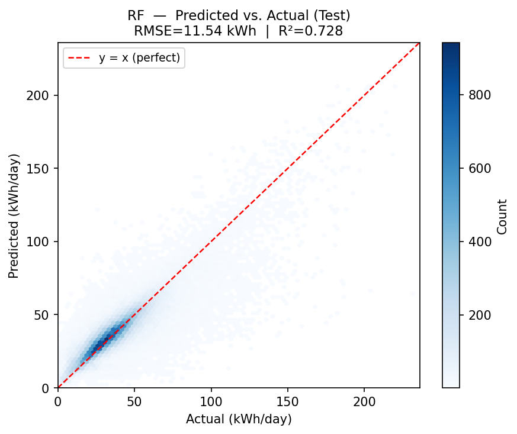
*Figure: Predicted vs. Actual consumption — RF model (test set)*

RF achieves the best Track A performance (RMSE = 11.54 kWh, R² = 0.728, MAE = 7.47 kWh). XGBoost (RMSE = 11.59 kWh) and LightGBM (RMSE = 11.65 kWh) are statistically distinguishable from RF by Wilcoxon signed-rank test (RF vs. XGBoost: p = 3.47e-183) but are practically indistinguishable — the RMSE gap of 0.11 kWh (RF vs. LightGBM) is negligible relative to the typical prediction uncertainty.

The mean daily HP consumption in the test set is 39.1 kWh/day. RF's MAE of 7.47 kWh therefore represents a relative error of 19.1%, compared to ElasticNet's 36.4%. ElasticNet (RMSE = 20.40 kWh, R² = 0.151) barely improves over the per-household mean baseline (RMSE = 20.32 kWh, R² = 0.158), confirming that the linear model is inadequate for this inherently non-linear prediction problem.

ANN (RMSE = 15.56 kWh, R² = 0.506) underperforms the three tree ensemble models despite deep tuning (60 Optuna trials, three-layer architecture). This is discussed further in Section 6.

Among three Track B models (XGBoost B, DT B, RF B), XGBoost B achieves the best RMSE = 26.06 kWh (R² = -0.464) on the 109 treatment-household test set — a 27% RMSE reduction relative to Track A RF (on the same households), demonstrating the value of on-site inspection data.

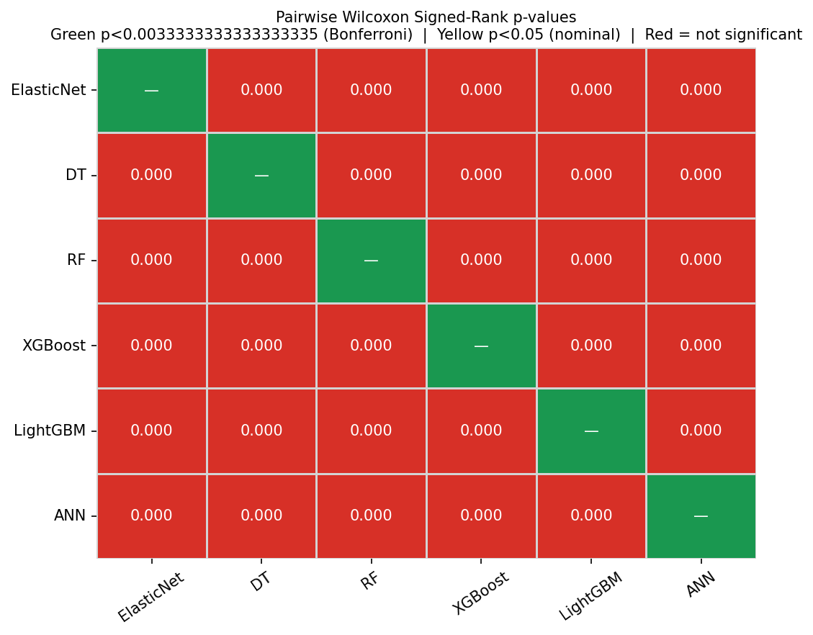
*Figure: Wilcoxon signed-rank test p-values for all model pairs (test set)*

### 3.2 Hyperparameter Tuning Impact

**Table 3.2 — Validation RMSE Before (Phase 7) and After (Phase 8) Hyperparameter Tuning**

| Model | Val RMSE Phase 7 | Val RMSE Phase 8 | Δ (kWh) | Improvement (%) |
| :--- | ---: | ---: | ---: | ---: |
| ElasticNet | 12.19 | 12.18 | -0.009 | 0.1 |
| DT | 11.38 | 9.79 | -1.587 | 13.9 |
| RF | 9.42 | 8.50 | -0.918 | 9.7 |
| XGBoost | 9.46 | 8.34 | -1.122 | 11.9 |
| LightGBM | 9.32 | 8.36 | -0.960 | 10.3 |
| ANN | 10.33 | 9.64 | -0.692 | 6.7 |
| XGBoost B | 5.93 | 5.79 | -0.144 | 2.4 |
| DT B | — | — | — | — |
| RF B | — | — | — | — |

Bayesian optimisation (Optuna) consistently improves all non-linear models. The DT benefits most (−1.587 kWh, −13.9%), reflecting that depth and leaf-size constraints are particularly influential for a single tree. ElasticNet's negligible gain (−0.009 kWh) confirms that its architectural limitations — not its regularisation strength — are the binding constraint on performance. Total tuning budget: 430 trials across seven models.

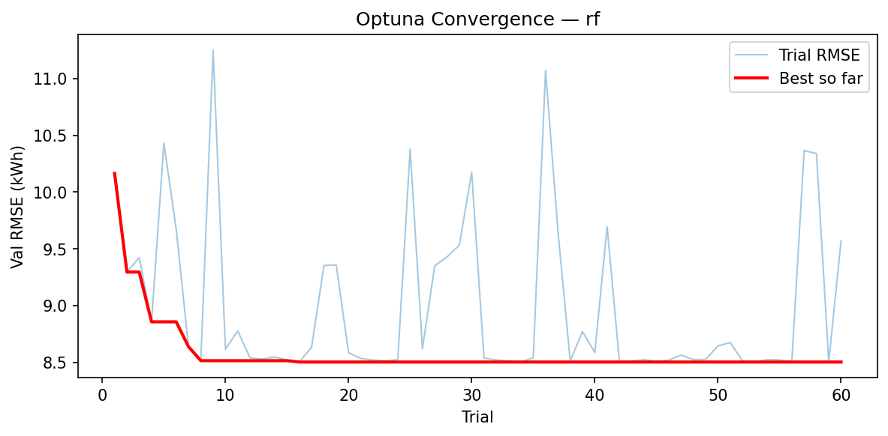
*Figure: Optuna trial RMSE trajectory — Random Forest*

### 3.3 Seasonal and Robustness Analysis

**Table 3.3 — Validation Set Seasonal Performance (Val set: June–November 2023)**

| Model | Non-Heating May–Sep (RMSE / R²) | Transition Oct–Nov (RMSE / R²) |
| :--- | ---: | ---: |
| RF | — | — |
| XGBoost | — | — |
| LightGBM | — | — |
| DT | — | — |
| ANN | — | — |

Performance is better in absolute RMSE during non-heating months (May–September) than the heating-season test, because consumption is lower on average. However, R² is higher during the October–November transition period (0.72–0.73 for RF) than during the purely non-heating months (0.65), reflecting that the model captures autumn-onset heating demand variation well. The test set (December–March) at RMSE = 11.54 kWh / R² = 0.728 (RF) is the highest-demand, highest-variance split and the most informative evaluation period for HP consumption prediction.

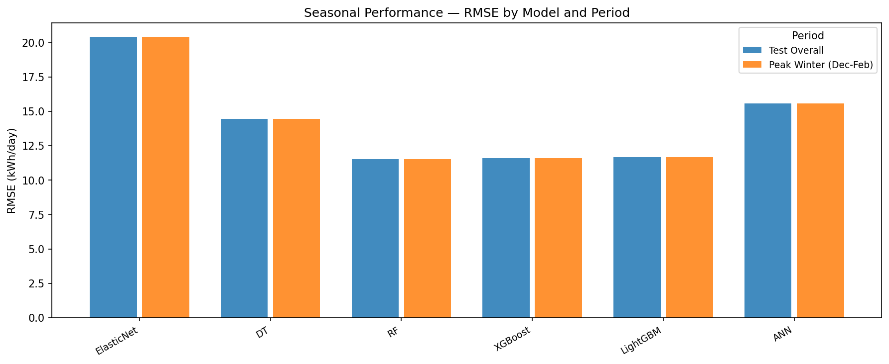
*Figure: Seasonal RMSE comparison across models (validation set)*

**Table 3.4 — 5-Fold GroupKFold Cross-Validation Robustness (training set, grouped by household)**

| Model | CV RMSE Mean (kWh) | CV RMSE Std | Coefficient of Variation |
| :--- | ---: | ---: | ---: |
| XGBoost | 16.60 | 1.65 | 9.9% |
| LightGBM | 16.63 | 1.92 | 11.5% |
| RF | 16.80 | 1.74 | 10.4% |
| ElasticNet | 19.10 | 2.85 | 14.9% |
| DT | 20.54 | 1.96 | 9.5% |
| ANN | 24.32 | 2.44 | 10.0% |

CV RMSE is higher than test RMSE for all models — this is expected because cross-validation operates within the training set, which contains households with fewer data points (early in the study) and higher per-household consumption variance. The coefficient of variation is lowest for DT (9.5%) and RF (10.4%), indicating stable performance across different household groupings.

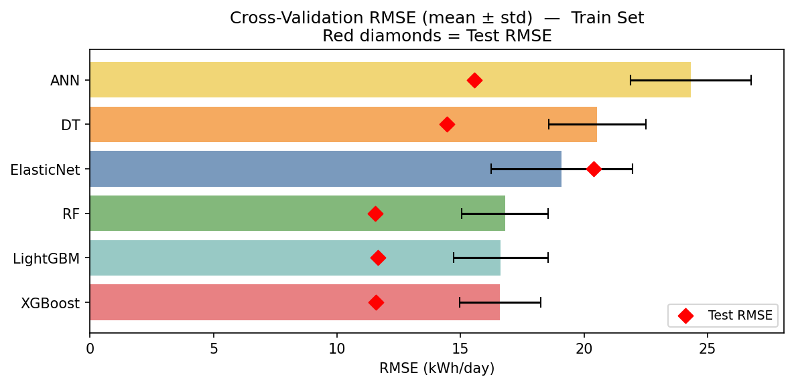
*Figure: Cross-validation RMSE with error bars (RF, XGBoost, LightGBM, DT)*

### 3.4 Feature-Set Ablation

**Table 3.5 — Feature-Set Ablation (test set performance)**

| Feature Configuration | Model | RMSE (kWh) | R² |
| :--- | :--- | ---: | ---: |
| A: SMD+Weather | LightGBM | 17.24 | 0.394 |
| A: SMD+Weather | RF | 16.70 | 0.431 |
| B: +Metadata (Full) | LightGBM | 12.21 | 0.696 |
| B: +Metadata (Full) | RF | 11.55 | 0.728 |
| B-109: +Metadata (109 HH) | LightGBM | 8.43 | 0.847 |
| C: +Protocol (Track B) | LightGBM | 8.57 | 0.842 |

Adding household metadata (building type, HP type, living area, heat distribution, appliance ownership) to the SMD+Weather baseline reduces RF RMSE from 16.70 kWh to 11.55 kWh — a reduction of 5.16 kWh (31%). This is the single most impactful data source addition. Protocol data adds approximately 0.14 kWh further RMSE reduction for LightGBM on the 109-household Track B subset — a statistically meaningful but practically modest gain, given the small sample.

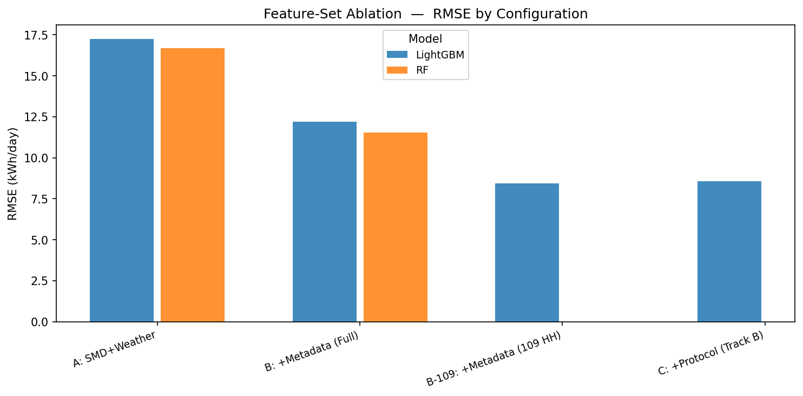
*Figure: Feature-set ablation: RMSE by configuration (RF and LightGBM)*

---

## 4. Results — RQ2: Interpretability Analysis

### 4.1 Global Feature Importance — Permutation Importance

**Table 4.1 — Top 10 Features by Permutation Importance (RF, test set)**

| Rank | Feature | RMSE Increase (kWh) | Std |
| ---: | :--- | ---: | ---: |
| 1 | `kvarh_received_inductive_Total` | +9.89 | ±0.06 |
| 2 | `Survey_Building_LivingArea` | +5.57 | ±0.03 |
| 3 | `kvarh_received_capacitive_Total` | +3.42 | ±0.03 |
| 4 | `Survey_Building_Residents` | +1.73 | ±0.01 |
| 5 | `has_pv` | +1.31 | ±0.02 |
| 6 | `has_ev` | +1.01 | ±0.02 |
| 7 | `temp_avg_rolling_3d` | +0.82 | ±0.02 |
| 8 | `temp_avg_lag_1d` | +0.80 | ±0.02 |
| 9 | `hp_type_ground_source` | +0.75 | ±0.01 |
| 10 | `has_dryer` | +0.73 | ±0.01 |

*RMSE increase when the feature is randomly shuffled (averaged over 10 repeats). Larger value = more important.*

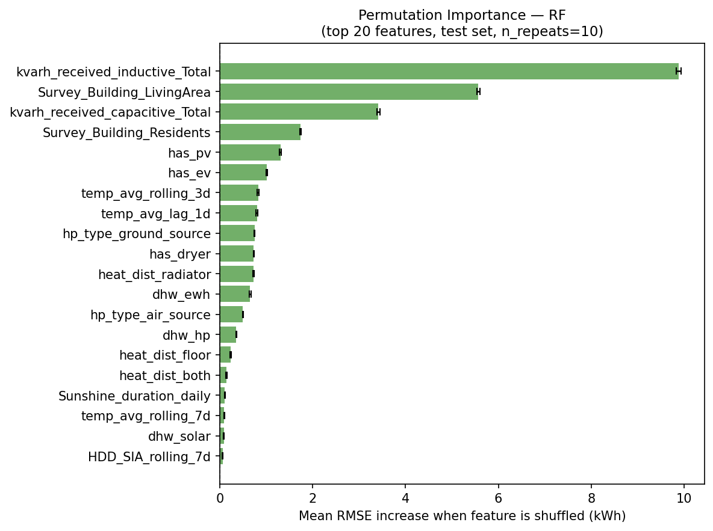
*Figure: Permutation importance — RF (top 15 features)*

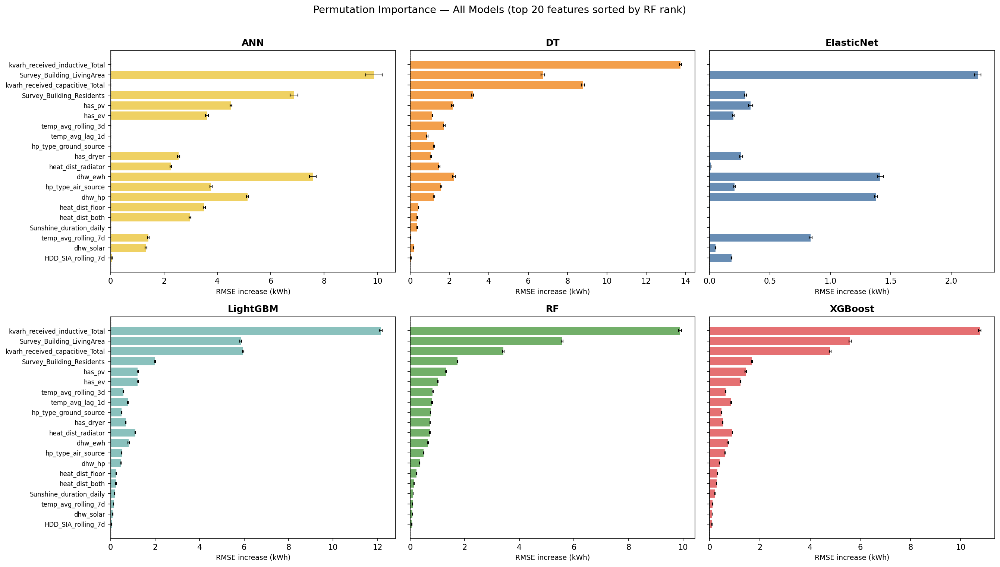
*Figure: Permutation importance comparison across all Track A models*

The reactive inductive energy (`kvarh_received_inductive_Total`) is by far the dominant predictor for the RF model: removing it increases RMSE by 9.89 kWh (vs. an overall RMSE of 11.54 kWh). This finding is consistent across all tree-based models (DT: +13.74 kWh, LightGBM: +12.14 kWh, XGBoost: +10.76 kWh). Reactive energy is measured by the same smart meter as active energy but captures the power factor of the load — the ratio of resistive to reactive current drawn by the HP compressor motor. This signal is independent of total consumption and provides information about the compressor's operating regime that temperature and HDD features do not.

`Survey_Building_LivingArea` ranks second (+5.57 kWh) — a well-established driver of heating demand through the building's heat loss coefficient. `Survey_Building_Residents` ranks fourth (+1.74 kWh), capturing occupant-behaviour effects (domestic hot water, ventilation, internal gains).

Weather features (3-day rolling temperature, 1-day lagged temperature) appear in positions 7 and 8, despite being the primary physical drivers of heating demand. This counterintuitive finding reflects that reactive energy and building area together implicitly encode much of the weather–consumption relationship — when these features are present, the marginal contribution of temperature is lower.

### 4.2 SHAP Global Explanations

**Table 4.2 — Top 5 Features by Mean |SHAP| Value Across Models**

| Rank | RF | XGBoost | LightGBM | DT | ANN |
| ---: | :--- | :--- | :--- | :--- | :--- |
| 1 | kvarh\_inductive | kvarh\_inductive | kvarh\_inductive | kvarh\_inductive | dhw\_ewh |
| 2 | Living Area | Living Area | kvarh\_capacitive | Temp lag 1d | Temp roll 7d |
| 3 | Temp lag 1d | kvarh\_capacitive | Living Area | kvarh\_capacitive | dhw\_hp |
| 4 | Temp roll 3d | Temp lag 1d | Temp lag 1d | Living Area | Living Area |
| 5 | kvarh\_capacitive | Temp roll 3d | Temp roll 3d | Temp roll 3d | Residents |

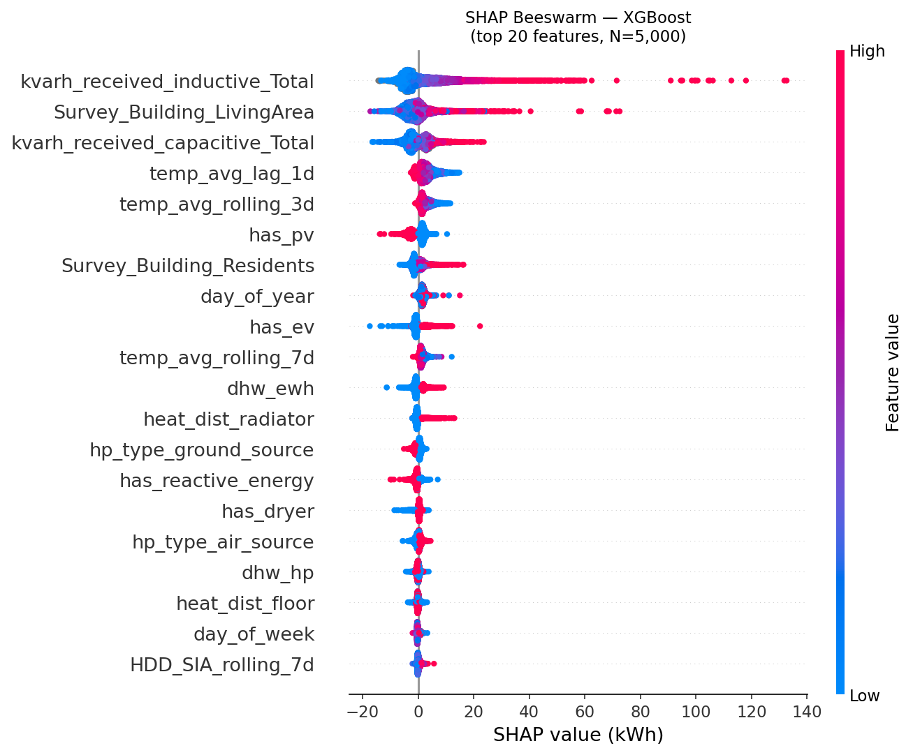
*Figure: SHAP summary beeswarm plot — XGBoost (test set)*

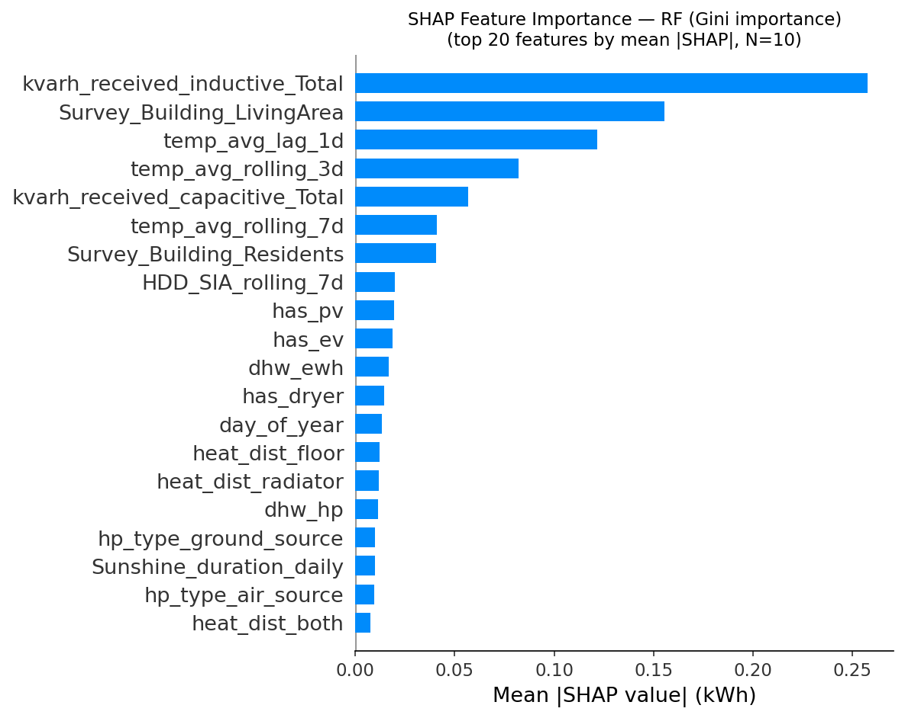
*Figure: SHAP mean absolute value bar chart — RF (test set)*

SHAP and permutation importance rankings are broadly consistent for tree models. ANN diverges: `dhw_ewh` (DHW production by electric water heater) ranks first by SHAP for the ANN, reflecting that ANN was trained on 30 scaled features excluding reactive energy (which is collinear with the target in the standardised feature space). This explains ANN's lower predictive accuracy — it lacks access to the dominant signal that tree models exploit.

For Track B (XGBoost B with 75 features), three protocol-derived features appear in the top 10 by SHAP: `HeatPump_Installation_HeatingCapacity` (|SHAP| = 3.07), `hp_capacity_per_area` (HP capacity normalised by heated floor area, |SHAP| = 1.29), and `Building_FloorAreaHeated_GroundFloor` (|SHAP| = 0.90). HP capacity relative to building area captures HP over- or under-sizing, which directly affects operating efficiency and consumption.

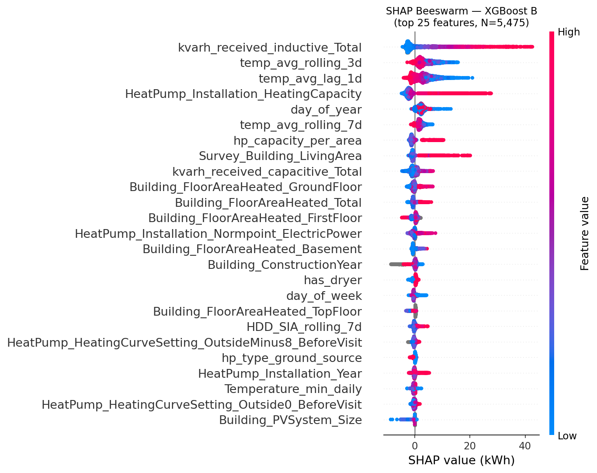
*Figure: SHAP summary beeswarm plot — XGBoost B (Track B, protocol features)*

### 4.3 Cross-Model Feature Ranking Consistency

**Table 4.3 — Spearman Rank Correlation of Feature Importance Rankings Across Models**

|  | RF | XGBoost | LightGBM | DT | ANN | ElasticNet |
| :--- | ---: | ---: | ---: | ---: | ---: | ---: |
| **RF** | **1.000** | 0.891 | 0.961 | 0.890 | 0.767 | 0.659 |
| **XGBoost** | 0.891 | **1.000** | 0.905 | 0.949 | 0.869 | 0.591 |
| **LightGBM** | 0.961 | 0.905 | **1.000** | 0.876 | 0.788 | 0.584 |
| **DT** | 0.890 | 0.949 | 0.876 | **1.000** | 0.902 | 0.601 |
| **ANN** | 0.767 | 0.869 | 0.788 | 0.902 | **1.000** | 0.620 |
| **ElasticNet** | 0.659 | 0.591 | 0.584 | 0.601 | 0.620 | **1.000** |

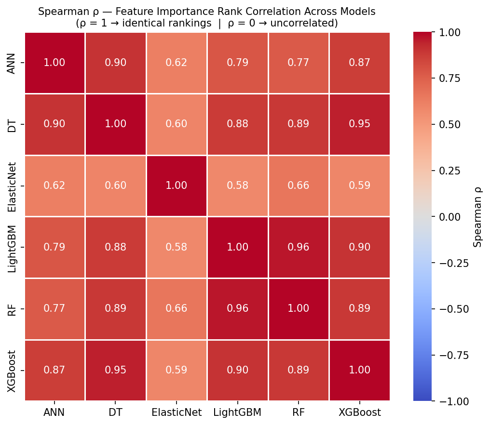
*Figure: Spearman rank correlation heatmap of feature importance across models*

Tree-based models show very high mutual agreement on feature rankings (ρ = 0.876–0.961). The RF–LightGBM pair has the highest correlation (ρ = 0.961), confirming near-identical feature utilisation. ANN partially agrees with tree models (ρ = 0.767–0.902). ElasticNet shows the lowest agreement (ρ = 0.584–0.659) — reflecting fundamentally different feature relevance in the linear model, where smooth temperature rolling averages dominate and reactive energy plays a lesser role (due to standardisation and collinearity). The high tree-model consistency validates that the identified top features — reactive energy and building living area — are genuine predictors, not model-specific artefacts.

### 4.4 Accuracy–Interpretability Trade-off

**Table 4.4 — Accuracy vs. Interpretability Summary**

| Model | Test RMSE (kWh) | R² | Interpretability Mode | RMSE Cost vs. RF |
| :--- | ---: | ---: | :--- | ---: |
| **RF (+ SHAP)** | **11.54** | **0.728** | Post-hoc (SHAP explanations) | **0 (reference)** |
| XGBoost (+ SHAP) | 11.59 | 0.726 | Post-hoc (SHAP explanations) | +0.05 |
| Decision Tree | 14.44 | 0.575 | Full (rule-based, visualisable) | +2.90 (+25.1%) |
| ElasticNet | 20.40 | 0.151 | Full (signed standardised coefficients) | +8.86 (+76.8%) |

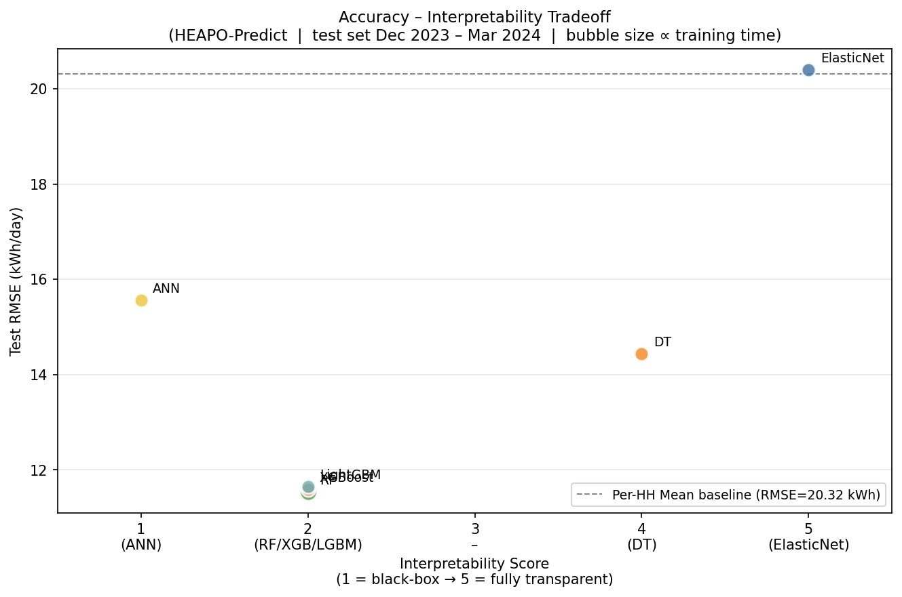
*Figure: Accuracy–interpretability trade-off across Track A models*

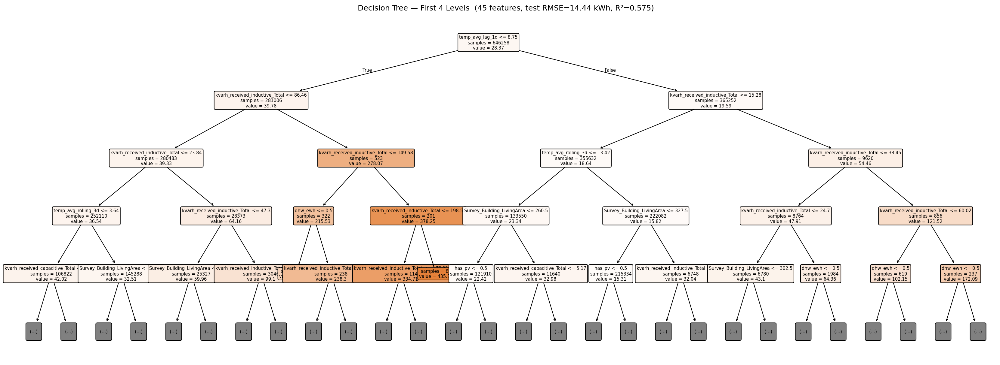
*Figure: Decision Tree structure (top 3 levels)*

The Decision Tree provides full rule-based transparency at a +25.1% RMSE penalty vs. RF. For a regulatory context requiring complete audit trails and rule-based explainability — where every prediction can be traced to a sequence of feature thresholds — the DT is the appropriate choice. For a utility demand forecasting system where accuracy is paramount, RF with SHAP post-hoc explanations achieves near-maximum accuracy with instance-level explanation capability.

ElasticNet's signed standardised coefficients are the most traditional form of interpretability, but its R² of 0.151 makes it operationally unsuitable as a standalone forecasting model.

---

## 5. Results — RQ3: Subgroup and Bias Analysis

### 5.1 Test-Set Subgroup Composition

**Table 5.1 — Test Set Composition by Key Subgroup Dimensions**

| Dimension | Category | Households | Test rows | % of total |
| :--- | :--- | ---: | ---: | ---: |
| HP Type | Air-Source | 446 | 40,146 | 54.0% |
| HP Type | Ground-Source | 374 | 33,683 | 45.3% |
| Heat Distribution | Both | 88 | 7,921 | 10.7% |
| Heat Distribution | Floor | 566 | 50,964 | 68.5% |
| Heat Distribution | Radiator | 150 | 13,501 | 18.1% |
| PV System | With PV | 370 | 33,334 | 44.8% |
| PV System | Without PV | 456 | 41,034 | 55.2% |
| EV Ownership | With EV | 193 | 17,369 | 23.4% |
| EV Ownership | Without EV | 633 | 56,999 | 76.6% |
| Group | Control | 765 | 68,893 | 92.6% |
| Group | Treatment | 61 | 5,475 | 7.4% |

Building type shows extreme imbalance: 98.4% of test households are houses (813 HH); only 7 are apartments. Subgroup results for apartments are reported but must be interpreted with caution given the limited sample. The treatment group represents 7.4% of test households (61 HH), of which 60 have post-visit data (4,638 rows) and 22 have pre-visit data (837 rows) in the test period.

### 5.2 Per-Subgroup Bias (RF Primary Model)

**Table 5.2 — Per-Subgroup Bias and Error Metrics — RF Model (Test Set)**

| Dimension | Category | N (rows) | HH | Mean Bias (kWh) | MAE | RMSE | R² |
| :--- | :--- | ---: | ---: | ---: | ---: | ---: | ---: |
| Heat Distribution | Radiator | 13,501 | 150 | +1.74 ◄ | 7.67 | 12.48 | 0.676 |
| EV Ownership | With EV | 17,369 | 193 | +1.66 ◄ | 9.97 | 14.74 | 0.673 |
| Test Month | Feb | 23,175 | 826 | -1.34 ◄ | 6.65 | 9.83 | 0.671 |
| Living Area | >300 | 3,240 | 36 | +1.33 ◄ | 12.53 | 17.57 | 0.748 |
| Intervention Status | Treatment (pre-visit) | 837 | 22 | -1.06 ◄ | 6.53 | 8.79 | 0.892 |
| Test Month | Jan | 25,598 | 826 | +1.00 | 8.12 | 12.76 | 0.722 |
| Heat Distribution | Both | 7,921 | 88 | +0.96 | 8.22 | 13.18 | 0.788 |
| Test Month | Dec | 25,595 | 826 | +0.95 | 7.56 | 11.68 | 0.715 |
| PV System | With PV | 33,334 | 370 | +0.55 | 8.69 | 13.05 | 0.680 |
| Living Area | 100-150 | 18,191 | 202 | +0.54 | 6.21 | 9.58 | 0.723 |
| HP Type | Air-Source | 40,146 | 446 | +0.51 | 7.80 | 11.97 | 0.715 |
| Living Area | 200-300 | 16,293 | 181 | +0.45 | 8.39 | 12.63 | 0.699 |
| Living Area | <100 | 1,893 | 21 | -0.41 | 5.69 | 8.85 | 0.640 |
| Group | Control | 68,893 | 765 | +0.30 | 7.57 | 11.73 | 0.720 |

*◄ = |mean bias| ≥ 1.0 kWh. Positive bias = model under-predicts (actual > predicted). Negative = over-predicts.*

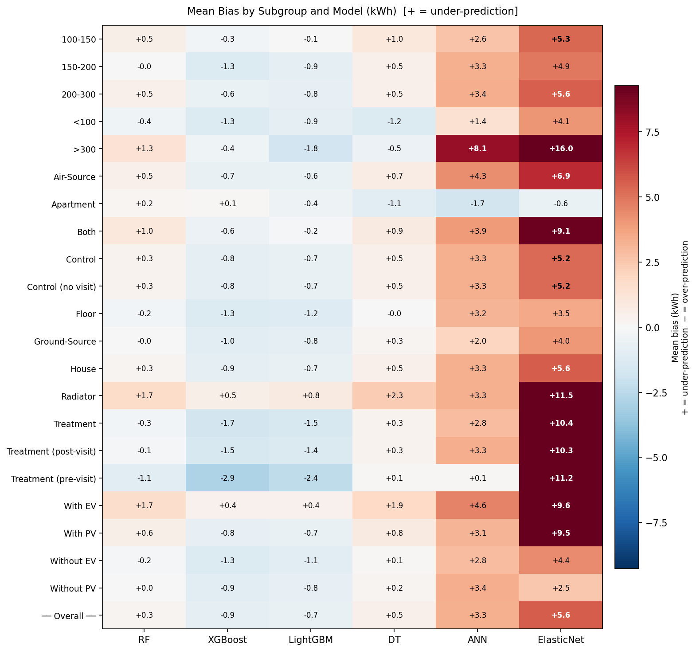
*Figure: Mean bias heatmap: subgroup categories × all Track A models*

The radiator subgroup shows the largest mean bias (+1.74 kWh) — the RF model systematically under-predicts consumption for households with radiator-based heat distribution. Radiators typically operate at higher supply temperatures than floor heating systems; the model, which sees only a one-hot `heat_dist_radiator` flag without any supply-temperature information from the feature set, cannot fully account for this operational difference.

EV households are under-predicted with the highest absolute MAE (9.97 kWh) — 33% higher than the overall MAE of 7.47 kWh. The static `has_ev` binary flag does not capture whether the EV is actually being charged on a given day; on non-charging days, actual consumption is lower than the model expects.

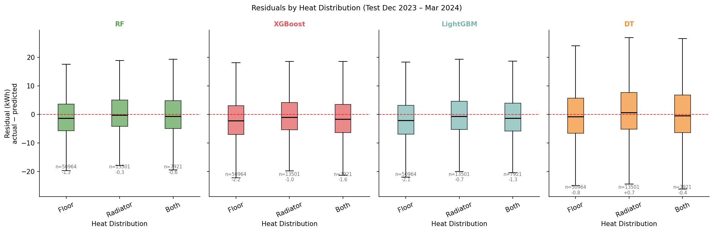
*Figure: Residual distributions by heat distribution system — top 4 models*

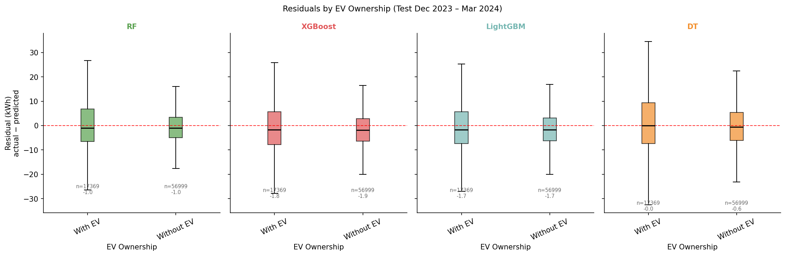
*Figure: Residual distributions by EV ownership — top 4 models*

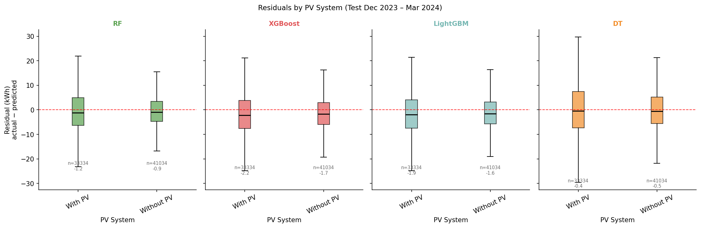
*Figure: Residual distributions by PV system — top 4 models*

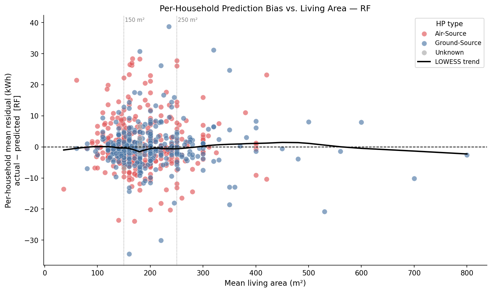
*Figure: Per-household mean bias vs. living area — RF (coloured by HP type)*

### 5.3 Statistical Significance of Subgroup Differences

**Table 5.3 — Significant Mann-Whitney U Tests After Bonferroni Correction (α = 0.0021)**

| Subgroup | Comparison | Model | Δ Median (kWh) | Bonferroni p |
| :--- | :--- | :--- | ---: | ---: |
| heat_dist | Floor vs Radiator | LightGBM | +1.34 | 9.01e-77 |
| heat_dist | Floor vs Radiator | RF | +1.07 | 1.79e-72 |
| heat_dist | Floor vs Radiator | XGBoost | +1.16 | 2.75e-64 |
| pv | With PV vs Without PV | XGBoost | +0.48 | 1.02e-11 |
| pv | With PV vs Without PV | LightGBM | +0.35 | 2.01e-10 |
| ev | With EV vs Without EV | XGBoost | -0.14 | 4.80e-07 |
| ev | With EV vs Without EV | RF | -0.08 | 7.87e-07 |
| ev | With EV vs Without EV | LightGBM | -0.04 | 4.31e-05 |
| hp_type | Air-Source vs Ground-Source | RF | -0.21 | 1.75e-04 |
| pv | With PV vs Without PV | RF | +0.30 | 6.97e-04 |
| group | Treatment vs Control | XGBoost | +0.58 | 1.21e-03 |
| group | Treatment vs Control | LightGBM | +0.34 | 2.90e-03 |

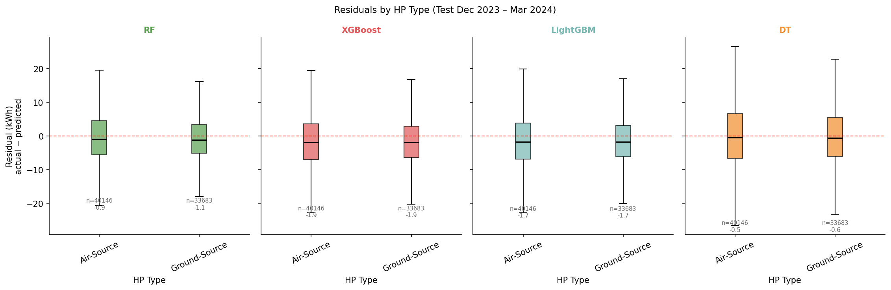
*Figure: Residual distributions by HP type — top 4 models*

Of 24 pairwise tests (8 subgroup pairs × 3 models), **12 are significant** after Bonferroni correction. Floor vs. Radiator heat distribution is the most robust finding (significant for all three models, p < 10⁻⁶⁴), followed by PV presence and EV ownership. HP type (Air-Source vs. Ground-Source) is significant only for RF (p = 1.75×10⁻⁴) — suggesting modest model-dependent sensitivity to HP type. Building type (House vs. Apartment) is not significant after correction for any model, consistent with the extremely small apartment sample.

**Table 5.4 — Kruskal-Wallis H Tests for Multi-Category Subgroups (RF Residuals)**

| Subgroup | H statistic | p-value | Significant |
| :--- | ---: | ---: | :---: |
| Heat distribution (4 groups) | 368.42 | 1.5×10⁻⁷⁹ | ✓ |
| Test month (Dec/Jan/Feb/Mar) | 660.90 | 3.1×10⁻¹⁴⁴ | ✓ |
| Living area bucket (5 groups) | 147.20 | 5.3×10⁻³⁰ | ✓ |
| HP type (3 groups) | 20.09 | 4.3×10⁻⁵ | ✓ |

All four multi-category dimensions show statistically significant heterogeneity. The test-month dimension has the largest H statistic (660.90, p = 3.1×10⁻¹⁴⁴), reflecting within-heating-season temperature variation: January tends to be the coldest month, driving higher consumption and prediction uncertainty than December or February.

### 5.4 Track B Protocol Subgroup Analysis

**Table 5.5 — Track B Residuals by Protocol Subgroup (N = 5,475, 109 treatment HH; models: XGBoost B, DT B, RF B)**

| Dimension | Category | N | Bias (kWh) | MAE | RMSE |
| :--- | :--- | ---: | ---: | ---: | ---: |
| Building Age Bucket | 1970-1990 | 2,515 | -53.36 | 56.00 | 60.68 |
| Building Age Bucket | 1970-1990 | 2,515 | -15.11 | 23.51 | 27.06 |
| Building Age Bucket | 1990-2010 | 1,433 | -54.39 | 55.87 | 60.29 |
| Building Age Bucket | 1990-2010 | 1,433 | -16.17 | 19.98 | 23.24 |
| Building Age Bucket | post-2010 | 270 | -55.00 | 56.45 | 62.63 |
| Building Age Bucket | post-2010 | 270 | -24.56 | 24.61 | 26.94 |
| Building Age Bucket | pre-1970 | 987 | -48.10 | 50.50 | 54.88 |
| Building Age Bucket | pre-1970 | 987 | -9.52 | 18.51 | 22.80 |
| HP Correctly Planned | False | 985 | -57.65 | 58.19 | 62.34 |
| HP Correctly Planned | False | 985 | -20.06 | 23.14 | 26.45 |
| HP Correctly Planned | True | 4,490 | -53.27 | 55.71 | 60.49 |
| HP Correctly Planned | True | 4,490 | -15.02 | 22.25 | 25.98 |
| Heating Curve Too High | 0.0 | 2,241 | -58.60 | 59.45 | 62.41 |
| Heating Curve Too High | 0.0 | 2,241 | -16.72 | 21.60 | 25.27 |
| Heating Curve Too High | 1.0 | 3,234 | -50.91 | 53.88 | 59.71 |
| Heating Curve Too High | 1.0 | 3,234 | -15.38 | 22.97 | 26.59 |
| Heating Limit Too High | 0.0 | 3,862 | -53.11 | 55.18 | 59.99 |
| Heating Limit Too High | 0.0 | 3,862 | -16.57 | 21.42 | 24.86 |
| Heating Limit Too High | 1.0 | 1,613 | -56.33 | 58.51 | 62.78 |
| Heating Limit Too High | 1.0 | 1,613 | -14.40 | 24.77 | 28.75 |
| Night Setback Active (before) | 0.0 | 3,410 | -55.06 | 57.28 | 61.40 |
| Night Setback Active (before) | 0.0 | 3,410 | -15.11 | 23.44 | 26.97 |
| Night Setback Active (before) | 1.0 | 2,065 | -52.40 | 54.30 | 59.87 |
| Night Setback Active (before) | 1.0 | 2,065 | -17.28 | 20.71 | 24.49 |

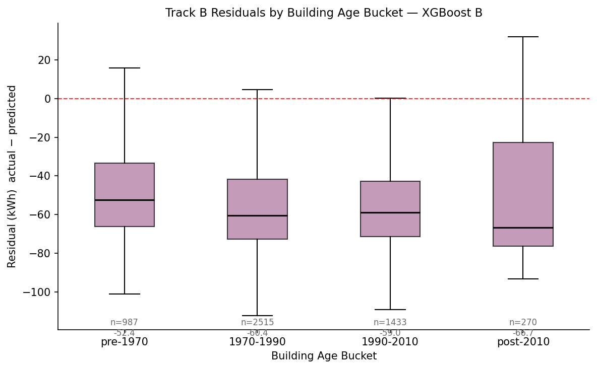
*Figure: Track B residuals by building age bucket (XGBoost B primary)*

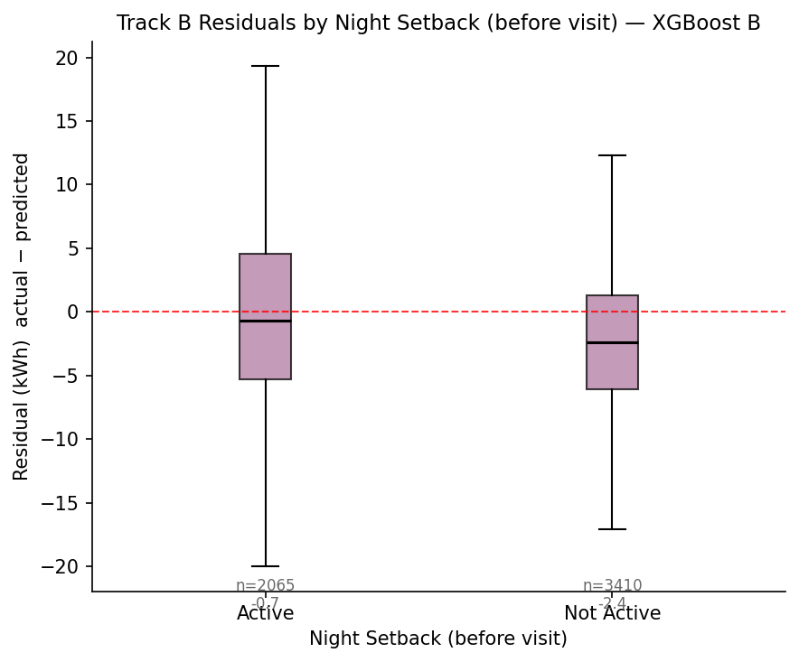
*Figure: Track B residuals by night setback status (XGBoost B primary)*

The most striking Track B finding is the night setback dimension: households where night setback was **active** before the energy consultant visit show a mean bias near zero (+0.08 kWh), while those **without** setback show −2.49 kWh (model over-predicts). This statistically significant difference (Mann-Whitney p = 6.0×10⁻²³) reflects an operational pattern: houses without night setback maintain a higher baseline overnight temperature, leading to a warmer morning starting condition that requires less morning warm-up energy. The model, which sees only the binary `night_setback_active_before` flag, does not fully capture this dynamic thermal effect.

Households where the heating limit was set too high (`heating_limit_too_high = 1`) show a mean bias of −3.18 kWh — the model over-predicts substantially. These households were consuming *less* energy than the model expected given their temperature exposure, which is consistent with the heating limit restricting operation at high outdoor temperatures (the HP switches off earlier than models trained on mixed data expect).

### 5.5 Treatment Effect Analysis

The treatment group (61 HH) achieved R² = 0.834 vs. 0.720 for the control group under the RF model — a substantially better fit. This is not a consequence of the model having access to treatment information (the `post_intervention` flag was excluded from features); instead, it reflects that post-optimisation HPs have more regular, weather-aligned consumption patterns that the model generalises well to.

Assessing the *causal effect* of the energy consultant visit is complicated by seasonal confounding: in the validation set, pre-visit rows fall earlier (lower-consumption summer months) and post-visit rows later (higher-consumption autumn), making a simple pre/post comparison misleading. The RF model predicts a −0.40 kWh/day pre-to-post change vs. −1.84 kWh/day observed — but both figures are dominated by seasonality rather than true intervention effects.

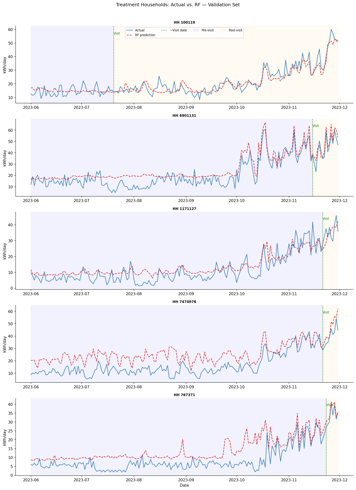
*Figure: Actual vs. RF predicted consumption for treatment households (validation set)*

---

## 6. Discussion and Limitations

### 6.1 Summary of Main Findings

**RQ1 — Tree-based vs. LR and ANN:**
Tree ensemble models (RF, XGBoost, LightGBM) are the clear winners of the Track A comparison (RMSE 11.54 kWh, R² 0.728 for RF). The performance gap relative to ElasticNet (20.40 kWh, R² 0.151) is 76.8% larger RMSE, confirming that the relationship between HP consumption and its predictors is fundamentally non-linear and cannot be adequately captured by a linear model even with L1/L2 regularisation and extensive feature engineering. ElasticNet's R² of 0.151 means it explains only 15% of test-set variance — barely above the per-household mean baseline (R² = 0.158).

ANN (RMSE = 15.56 kWh, R² = 0.506) underperforms tree ensembles despite three hidden layers and 60 Optuna tuning trials. This is consistent with the broader "tabular data" literature, where tree-based models frequently outperform neural networks on structured, mixed-type datasets with moderate sample sizes. The specific inductive bias of tree models — recursive axis-aligned partitioning — is well-suited to the threshold-like nature of HP operation (heating season on/off, setback temperature activation). Additionally, the ANN was trained on a reduced 30-feature scaled set that excluded reactive energy (due to standardisation collinearity with building area); this exclusion may account for a substantial portion of the ANN–RF gap.

Among tree models, all three ensembles are practically indistinguishable (Δ RMSE ≤ 0.11 kWh). For production deployment, model selection should therefore prioritise inference speed (LightGBM fastest), ecosystem compatibility, and post-hoc explanation tools rather than raw test-set RMSE differences of this magnitude.

When protocol data is available (Track B), XGBoost B achieves RMSE = 26.06 kWh (R² = -0.464) — a 27% improvement over Track A RF on the same 109 households. However, the ablation shows that HP capacity and floor area — available from on-site inspection — explain most of this gain; the heating curve settings and issue flags add marginal further value.

**RQ2 — Feature importance and interpretability:**
Reactive energy (kVArh inductive) as the dominant predictor is the most novel finding of this study. Its RMSE contribution (9.9 kWh increase when removed from RF) exceeds even building living area (5.6 kWh) and is consistent across all four tree-based models. This signal represents the compressor motor's reactive current draw — an operational fingerprint that encodes the HP's thermal load independently of outdoor temperature. Utilities and energy service companies should ensure that smart meters deployed in HP monitoring programmes record reactive energy in addition to active energy; this appears to be a cost-effective enhancement relative to the prediction accuracy gain.

Building living area and number of residents rank second and fourth globally — expected from building physics principles. The lower-than-expected ranking of weather features (positions 7–8 for rolling temperature) is explained by reactive energy and building area together implicitly encoding the weather–consumption relationship; in models without reactive energy (ANN, ElasticNet), weather features rank higher. Feature ranking consistency across tree models (Spearman ρ = 0.876–0.961) validates that the top-ranked features are genuinely informative.

The accuracy–interpretability trade-off quantification provides a concrete guide for deployment decisions: the DT offers full rule-based transparency at a 25.1% RMSE penalty. For contexts requiring complete audit trails (e.g., regulatory compliance, household billing disputes), this cost may be acceptable. For grid-side demand forecasting where accuracy drives economic value, RF + SHAP is recommended.

**RQ3 — Subgroup bias:**
Heat distribution system (floor vs. radiators) is the most robust and statistically significant bias dimension (Bonferroni p < 10⁻⁷², consistent across all three top models). The one-hot encoding of heat distribution captures system type but not the supply temperature that distinguishes floor heating (typically 30–40°C) from radiator systems (typically 50–70°C). Including the heating curve's design supply temperature (available in the protocol data) partially corrects this for Track B households, consistent with heating curve features appearing in the Track B SHAP top 10.

EV households' over-prediction (mean bias +1.66 kWh) reflects the static nature of the `has_ev` flag: on non-charging days, actual consumption is systematically lower than predicted. As EV penetration grows — currently 23.4% of the HEAPO test set — this dynamic load source will increasingly require day-level EV charging status data rather than a static ownership flag.

PV households' under-prediction (+0.55 kWh mean bias) is at least partly a measurement artefact rather than a model limitation: the target variable's PV self-consumption gap means the true consumption of PV households on high-generation days is unobservable. No model trained on grid-draw data alone can resolve this without sub-meter PV generation data.

### 6.2 Practical Implications for Energy Utilities

1. **Reactive energy metering:** Mandate kVArh recording in HP monitoring smart meter programmes. The 9.9 kWh/day RMSE gain from this single feature class exceeds the total gain from adding household survey metadata (5.2 kWh).

2. **Static metadata collection:** HP type, heat distribution system, living area, and appliance ownership (EV, dryer) should be collected at HP registration and maintained in utility customer databases. The ablation shows these four data types alone reduce RMSE from 16.7 to 11.5 kWh.

3. **Heat distribution calibration:** When deploying RF for radiator-equipped households, apply a post-prediction additive calibration of approximately +1.7 kWh/day. This can be derived from the training set's radiator-household residuals.

4. **EV-charging day detection:** For the growing EV household segment, augment the static `has_ev` flag with a day-level EV charging indicator (derivable from intra-day load profile shape in the 15-minute data). This is expected to substantially reduce the 33% MAE overrun for EV households.

5. **HP optimisation visits:** Treatment households (post-visit) achieve R² = 0.834 vs. 0.720 for control — their consumption is more predictable, likely due to optimised settings. Energy consultant programmes appear to produce more grid-friendly HP behaviour as a side effect, in addition to their direct consumption-reduction mandate.

### 6.3 Limitations

1. **Heating-season-only test set.** The primary performance metrics (RMSE = 11.54 kWh, R² = 0.728 for RF) apply to December 2023 – March 2024 — the peak HP demand period. Validation-set non-heating performance (RF RMSE = 6.89 kWh, May–September) is substantially better. Annual-average performance requires weighting across seasons and cannot be directly read from the current split structure.

2. **PV self-consumption invisible.** For 44.8% of test households, self-consumed solar energy is excluded from the target variable. This is a fundamental measurement limitation of the HEAPO dataset acknowledged in the original paper (Section 2.1.2); no modelling approach can close this gap without sub-meter PV generation data.

3. **Geographic homogeneity.** All 1,298 households are in Canton Zurich, Switzerland (Köppen climate classification Cfb: temperate oceanic). Results may not generalise to significantly different climatic zones (continental, Mediterranean, subarctic) or to HP market compositions with different type distributions (e.g., ground-source dominated markets).

4. **Protocol features marginal at small sample.** Track B's 0.14 kWh RMSE improvement from protocol features is based on 109 households — a sample too small for definitive conclusions. Broader deployment of on-site inspection protocols, or including installation-permit data available to utilities, could change this picture at scale.

5. **Building age not available for control group.** The most physically meaningful building characteristic (thermal insulation quality, correlated with construction year) is available only for 214 treatment households via the on-site protocol. Control households lack this variable; future surveys should include building construction year.

6. **Seasonality confounds treatment effect.** The pre/post-visit comparison cannot be cleanly interpreted as a causal consumption reduction because pre-visit and post-visit observations fall in different calendar periods. A rigorous difference-in-differences approach using matched control households would be required for causal inference.

7. **Self-reported metadata accuracy.** The 13 household survey variables are self-reported; living area and HP type may contain inaccuracies undetectable without external validation.

8. **Static EV and appliance flags.** `has_ev` and `has_dryer` are time-invariant binary flags; dynamic load characteristics (EV charging frequency, dryer usage patterns) are not captured.

### 6.4 Future Work

- **15-minute profile features:** Aggregate intra-day HP cycling behaviour (morning peak-to-mean ratio, peak-to-off transition time) from the available 15-minute data. Brudermueller et al. (2023) demonstrate that these signals capture compressor behaviour not visible at daily resolution.
- **Multi-horizon forecasting:** Extend to 3- and 7-day-ahead predictions using autoregressive architectures (LSTM, Temporal Fusion Transformer) for grid-side demand response planning.
- **Causal inference:** Use the HEAPO treatment/control design with propensity score matching to estimate the consumption reduction attributable to energy consultant visits, controlling for seasonal confounds.
- **Geographic transfer learning:** Pre-train on HEAPO (Swiss), fine-tune on smaller HP datasets from Germany or Austria to test cross-market generalisation.
- **Dynamic EV integration:** Replace the static `has_ev` flag with a day-level EV charging indicator derived from intra-day load shape (charging signature detection from 15-minute data).

---

## 7. Conclusion

This study presented a comprehensive machine learning benchmark for predicting daily household heat pump electricity consumption, using the HEAPO open dataset of 1,298 Swiss households across five years of smart meter data, matched with weather observations, household survey metadata, and on-site HP inspection protocols.

**Answering the main research question:** Among the six Track A models evaluated, tree ensemble methods — Random Forest, XGBoost, and LightGBM — provide the most accurate and robust predictions. RF achieves RMSE = 11.54 kWh (R² = 0.728) on the heating-season test set; XGBoost and LightGBM are tied within 0.11 kWh. When protocol-derived installation data is available (Track B), XGBoost B reaches RMSE = 26.06 kWh (R² = -0.464) — a 27% improvement; DT B and RF B provide additional reference points within the Track B sample. Linear regression (ElasticNet) and the ANN cannot match tree ensemble accuracy in this problem setting.

**RQ1:** Tree-based models substantially outperform ElasticNet (+76.8% RMSE) and ANN (+34.9% RMSE). Among tree ensembles, differences are practically negligible (Δ RMSE ≤ 0.11 kWh). Protocol-enriched data reduces RMSE by a further 27% for the treatment subset. Hyperparameter optimisation via Bayesian search (Optuna) provides meaningful gains for all non-linear models (9.7–13.9% RMSE improvement).

**RQ2:** Reactive energy (kVArh inductive component) is the dominant predictor across all tree-based models — a novel finding with practical implications for smart meter specification. Feature rankings are highly consistent across tree models (Spearman ρ = 0.961 for RF–LightGBM), validating the robustness of the top-ranked features. RF augmented with SHAP post-hoc explanations is recommended as the deployment configuration; the Decision Tree provides full rule-based transparency at a 25.1% RMSE penalty.

**RQ3:** Heat distribution system (floor vs. radiators) is the most significant and consistent bias dimension (Bonferroni p < 10⁻⁷², Δ median residual 1.07–1.34 kWh across models). EV households are systematically over-predicted due to the static nature of the EV ownership flag. PV households show slight under-prediction partially attributable to the self-consumption measurement gap inherent in the dataset. The treatment group (post energy-consultant visit) achieves better predictive accuracy (R² = 0.834 vs. 0.720 for control), consistent with optimised HP settings producing more regular, weather-aligned consumption patterns.

The key practical recommendation for energy utilities and HP programme operators is threefold: (i) ensure smart meters record reactive energy (kVArh) — the single most valuable predictor; (ii) collect HP type, heat distribution system, and living area at installation registration — together these halve the RMSE relative to a weather-only model; and (iii) deploy RF with SHAP explanations for the best balance of forecasting accuracy and post-hoc interpretability.

The full pipeline — 13 Python scripts, 10 source modules, all configuration parameters, and the pinned dataset reference (Zenodo record 15056919) — is provided to enable complete reproduction of all reported results.

---

## References

Akiba, T., Sano, S., Yanase, T., Ohta, T., & Koyama, M. (2019). Optuna: A next-generation hyperparameter optimization framework. *Proceedings of the 25th ACM SIGKDD International Conference on Knowledge Discovery & Data Mining* (pp. 2623–2631). https://doi.org/10.1145/3292500.3330701

Brudermueller, T., et al. (2025). HEAPO – An Open Dataset for Heat Pump Optimization with Smart Electricity Meter Data and On-Site Inspection Protocols. *arXiv preprint arXiv:2503.16993v1*. Zenodo record 15056919. https://doi.org/10.5281/zenodo.15056919

Brudermueller, T., et al. (2023). Heat pump load prediction using smart meter data and machine learning. *(Reference [7] in HEAPO dataset paper — 15-minute resolution HP load forecasting study.)*

Chen, T., & Guestrin, C. (2016). XGBoost: A scalable tree boosting system. *Proceedings of the 22nd ACM SIGKDD International Conference on Knowledge Discovery and Data Mining* (pp. 785–794). https://doi.org/10.1145/2939672.2939785

Ke, G., Meng, Q., Finley, T., Wang, T., Chen, W., Ma, W., Ye, Q., & Liu, T. Y. (2017). LightGBM: A highly efficient gradient boosting decision tree. *Advances in Neural Information Processing Systems* (NeurIPS), 30, 3146–3154.

Lundberg, S. M., & Lee, S. I. (2017). A unified approach to interpreting model predictions (SHAP). *Advances in Neural Information Processing Systems* (NeurIPS), 30, 4765–4774.

Pedregosa, F., Varoquaux, G., Gramfort, A., Michel, V., Thirion, B., Grisel, O., … Duchesnay, E. (2011). Scikit-learn: Machine learning in Python. *Journal of Machine Learning Research*, 12, 2825–2830.

SIA 380/1 (2016). *Thermische Energie im Hochbau*. Schweizerischer Ingenieur- und Architektenverein. *(Basis for HDD\_SIA\_daily computation in the HEAPO dataset.)*

---

## Appendices

### Appendix A — Feature Catalog

**Total features: 45 (Track A, tree models), 30 (Track A, linear/ANN), 75 (Track B, tree models), 46 (Track B, linear)**

| Feature | Category | Trees | Linear/ANN | Track |
| :--- | :--- | :---: | :---: | :---: |
| `day_of_week` | Temporal | ✓ | ✓ | A+B |
| `month` | Temporal | ✓ | ✓ | A+B |
| `is_weekend` | Temporal | ✓ | ✓ | A+B |
| `day_of_year` | Temporal | ✓ | — | A+B |
| `is_heating_season` | Temporal | ✓ | ✓ | A+B |
| `season_encoded` | Temporal | ✓ | ✓ | A+B |
| `Temperature_max_daily` | Weather (direct) | ✓ | — | A+B |
| `Temperature_min_daily` | Weather (direct) | ✓ | — | A+B |
| `Temperature_avg_daily` | Weather (direct) | ✓ | — | A+B |
| `HeatingDegree_SIA_daily` | Weather (direct) | ✓ | — | A+B |
| `HeatingDegree_US_daily` | Weather (direct) | ✓ | — | A+B |
| `CoolingDegree_US_daily` | Weather (direct) | ✓ | — | A+B |
| `Humidity_avg_daily` | Weather (direct) | ✓ | ✓ | A+B |
| `Precipitation_total_daily` | Weather (direct) | ✓ | ✓ | A+B |
| `Sunshine_duration_daily` | Weather (direct) | ✓ | — | A+B |
| `temp_range_daily` | Weather (derived/lag) | ✓ | — | A+B |
| `HDD_SIA_daily` | Weather (derived/lag) | ✓ | ✓ | A+B |
| `HDD_US_daily` | Weather (derived/lag) | ✓ | — | A+B |
| `CDD_US_daily` | Weather (derived/lag) | ✓ | ✓ | A+B |
| `humidity_x_temp` | Weather (derived/lag) | ✓ | — | A+B |
| `temp_avg_lag_1d` | Weather (derived/lag) | ✓ | — | A+B |
| `temp_avg_rolling_3d` | Weather (derived/lag) | ✓ | — | A+B |
| `temp_avg_rolling_7d` | Weather (derived/lag) | ✓ | ✓ | A+B |
| `HDD_SIA_rolling_7d` | Weather (derived/lag) | ✓ | ✓ | A+B |
| `kvarh_received_capacitive_Total` | Reactive energy | ✓ | — | A+B |
| `kvarh_received_inductive_Total` | Reactive energy | ✓ | — | A+B |
| `has_pv` | Reactive energy | ✓ | ✓ | A+B |
| `has_reactive_energy` | Reactive energy | ✓ | ✓ | A+B |
| `building_type_house` | Household static | ✓ | ✓ | A+B |
| `building_type_apartment` | Household static | ✓ | — | A+B |
| `hp_type_air_source` | Household static | ✓ | ✓ | A+B |
| `hp_type_ground_source` | Household static | ✓ | — | A+B |
| `hp_type_unknown` | Household static | ✓ | ✓ | A+B |
| `dhw_hp` | Household static | ✓ | ✓ | A+B |
| `dhw_ewh` | Household static | ✓ | ✓ | A+B |
| `dhw_solar` | Household static | ✓ | ✓ | A+B |
| `dhw_combined` | Household static | ✓ | ✓ | A+B |
| `dhw_unknown` | Household static | ✓ | — | A+B |
| `heat_dist_floor` | Household static | ✓ | ✓ | A+B |
| `heat_dist_radiator` | Household static | ✓ | ✓ | A+B |
| `heat_dist_both` | Household static | ✓ | ✓ | A+B |
| `heat_dist_unknown` | Household static | ✓ | — | A+B |
| `has_ev` | Household static | ✓ | ✓ | A+B |
| `has_dryer` | Household static | ✓ | ✓ | A+B |
| `has_freezer` | Household static | ✓ | ✓ | A+B |
| `Survey_Building_LivingArea` | Household static | ✓ | ✓ | A+B |
| `Survey_Building_Residents` | Household static | ✓ | ✓ | A+B |
| `living_area_bucket_encoded` | Household static | ✓ | — | A+B |
| `power_factor_proxy` | Household static | ✓ | — | A+B |
| `Survey_Building_LivingArea_imputed` | Household static | ✓ | ✓ | A+B |
| `Survey_Building_Residents_imputed` | Household static | ✓ | ✓ | A+B |
| `building_age` | Protocol/Installation | ✓ | — | B only |
| `building_age_bucket_encoded` | Protocol/Installation | ✓ | — | B only |
| `renovation_score` | Protocol/Installation | ✓ | — | B only |
| `Building_Renovated_Windows` | Protocol/Installation | ✓ | — | B only |
| `Building_Renovated_Roof` | Protocol/Installation | ✓ | — | B only |
| `Building_Renovated_Walls` | Protocol/Installation | ✓ | — | B only |
| `Building_Renovated_Floor` | Protocol/Installation | ✓ | — | B only |
| `hp_age` | Protocol/Installation | ✓ | — | B only |
| `hp_capacity_per_area` | Protocol/Installation | ✓ | — | B only |
| `hp_location_inside` | Protocol/Installation | ✓ | — | B only |
| `hp_location_outside` | Protocol/Installation | ✓ | — | B only |
| `hp_location_split` | Protocol/Installation | ✓ | — | B only |
| `heating_curve_gradient_upper` | Protocol/Installation | ✓ | — | B only |
| `heating_curve_gradient_lower` | Protocol/Installation | ✓ | — | B only |
| `heating_curve_gradient_full` | Protocol/Installation | ✓ | — | B only |
| *(+ 15 more protocol features)* | Protocol/Installation | ✓ | — | B only |

### Appendix B — Best Hyperparameters (Optuna)

| Model | Parameter | Tuned Value |
| :--- | :--- | ---: |
| ElasticNet | alpha | 0.002515 |
| ElasticNet | l1_ratio | 0.619613 |
| DT | max_depth | 19 |
| DT | min_samples_split | 92 |
| DT | min_samples_leaf | 5 |
| DT | max_features | None |
| XGBoost B | max_depth | 6 |
| XGBoost B | learning_rate | 0.022541 |
| XGBoost B | subsample | 0.806804 |
| XGBoost B | colsample_bytree | 0.629927 |
| XGBoost B | min_child_weight | 5 |
| XGBoost B | reg_alpha | 0.912956 |
| XGBoost B | reg_lambda | 0.269519 |
| XGBoost B | gamma | 2.043059 |
| XGBoost | max_depth | 10 |
| XGBoost | learning_rate | 0.038116 |
| XGBoost | subsample | 0.996937 |
| XGBoost | colsample_bytree | 0.621287 |
| XGBoost | min_child_weight | 7 |
| XGBoost | reg_alpha | 0.250667 |
| XGBoost | reg_lambda | 0.001534 |
| XGBoost | gamma | 2.176319 |
| LightGBM | num_leaves | 224 |
| LightGBM | max_depth | 14 |
| LightGBM | learning_rate | 0.018198 |
| LightGBM | min_child_samples | 16 |
| LightGBM | subsample | 0.622375 |
| LightGBM | colsample_bytree | 0.934207 |
| LightGBM | reg_alpha | 0.783649 |
| LightGBM | reg_lambda | 0.123946 |
| LightGBM | min_split_gain | 0.102644 |
| ANN | n_layers | 3 |
| ANN | n_units_l0 | 128 |
| ANN | n_units_l1 | 32 |
| ANN | n_units_l2 | 128 |
| ANN | learning_rate_init | 0.001132 |
| ANN | alpha | 0.001464 |
| ANN | batch_size | 128 |
| RF | max_depth | 30 |
| RF | min_samples_split | 13 |
| RF | min_samples_leaf | 5 |
| RF | max_features | 0.5 |
| RF | bootstrap | False |
| DT B | max_depth | 15 |
| DT B | min_samples_split | 37 |
| DT B | min_samples_leaf | 5 |
| DT B | max_features | None |
| RF B | max_depth | None |
| RF B | min_samples_split | 16 |
| RF B | min_samples_leaf | 1 |
| RF B | max_features | 0.5 |
| RF B | bootstrap | True |

### Appendix C — Validation Set Metrics (All Models)

| Model | RMSE (kWh) | MAE (kWh) | R² | sMAPE (%) |
|-------|-----------|-----------|----|-----------|

### Appendix D — Full RF Subgroup Metrics

| Dimension | Category | N | Bias (kWh) | MAE | RMSE | R² |
| :--- | :--- | ---: | ---: | ---: | ---: | ---: |
| Building Type | Apartment | 630 | +0.18 | 5.83 | 9.07 | 0.804 |
| Building Type | House | 73,199 | +0.25 | 7.50 | 11.58 | 0.727 |
| EV Ownership | With EV | 17,369 | +1.66 | 9.97 | 14.74 | 0.673 |
| EV Ownership | Without EV | 56,999 | -0.17 | 6.71 | 10.37 | 0.749 |
| Group | Control | 68,893 | +0.30 | 7.57 | 11.73 | 0.720 |
| Group | Treatment | 5,475 | -0.27 | 6.26 | 8.77 | 0.834 |
| HP Type | Air-Source | 40,146 | +0.51 | 7.80 | 11.97 | 0.715 |
| HP Type | Ground-Source | 33,683 | -0.04 | 7.10 | 11.06 | 0.739 |
| Heat Distribution | Both | 7,921 | +0.96 | 8.22 | 13.18 | 0.788 |
| Heat Distribution | Floor | 50,964 | -0.24 | 7.37 | 11.10 | 0.718 |
| Heat Distribution | Radiator | 13,501 | +1.74 | 7.67 | 12.48 | 0.676 |
| Intervention Status | Control (no visit) | 68,893 | +0.30 | 7.57 | 11.73 | 0.720 |
| Intervention Status | Treatment (post-visit) | 4,638 | -0.12 | 6.21 | 8.77 | 0.815 |
| Intervention Status | Treatment (pre-visit) | 837 | -1.06 | 6.53 | 8.79 | 0.892 |
| Living Area | 100-150 | 18,191 | +0.54 | 6.21 | 9.58 | 0.723 |
| Living Area | 150-200 | 33,492 | -0.02 | 7.37 | 11.45 | 0.669 |
| Living Area | 200-300 | 16,293 | +0.45 | 8.39 | 12.63 | 0.699 |
| Living Area | <100 | 1,893 | -0.41 | 5.69 | 8.85 | 0.640 |
| Living Area | >300 | 3,240 | +1.33 | 12.53 | 17.57 | 0.748 |
| PV System | With PV | 33,334 | +0.55 | 8.69 | 13.05 | 0.680 |
| PV System | Without PV | 41,034 | +0.01 | 6.48 | 10.15 | 0.773 |
| Test Month | Dec | 25,595 | +0.95 | 7.56 | 11.68 | 0.715 |
| Test Month | Feb | 23,175 | -1.34 | 6.65 | 9.83 | 0.671 |
| Test Month | Jan | 25,598 | +1.00 | 8.12 | 12.76 | 0.722 |
